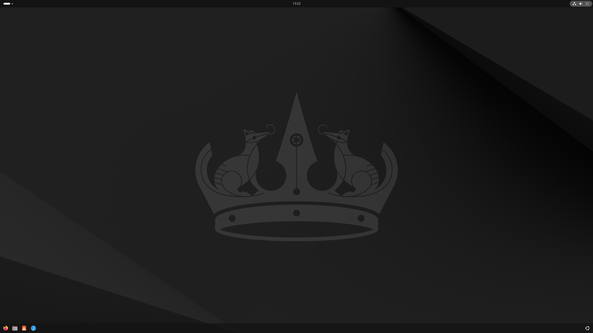

# Slickgnome

Turn newly installed Ubuntu gnome desktop into pretty, slick,
ready to work one with night light and other
slick gnome settings already configured.

## FROM


## TO



## HOW

Run this script in your terminal to change gnome's gsettings to make
it prettier and more slick on Ubuntu. No manual download or cloning required.
It just works.

```bash
wget -qO- https://raw.githubusercontent.com/monoira/slickgnome/main/gnome_settings.sh | bash
```

### THIS WILL

- Setup night-light settings.
- Setup dash-to-dock settings.
- Make dash-to-dock horizontal.
- Hide the trash from dash-to-dock.
- Hide home directory on desktop.
- Show apps from current workspace only.
- Reduce size of desktop icons to small since
  large icons are way to big and ugly.
- Etc.

You can see what more it changes by reading the script itself at
[gnome_settings.sh](./gnome_settings.sh)
