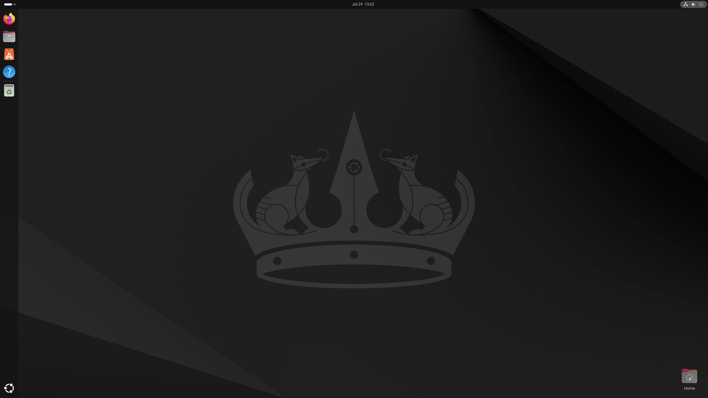

# Slickbuntu

Turn newly installed Ubuntu gnome desktop into pretty, slick, ready to work one.

## FROM



## TO


## how

Run this script to change gnome's gsettings to make
it prettier and more slick on Ubuntu.

You can see what it changes by reading the script itself
[gnome-settings.sh](./gnome-settings.sh)

```bash
wget -qO- https://raw.githubusercontent.com/monoira/slickbuntu/main/gnome-settings.sh | bash
```
